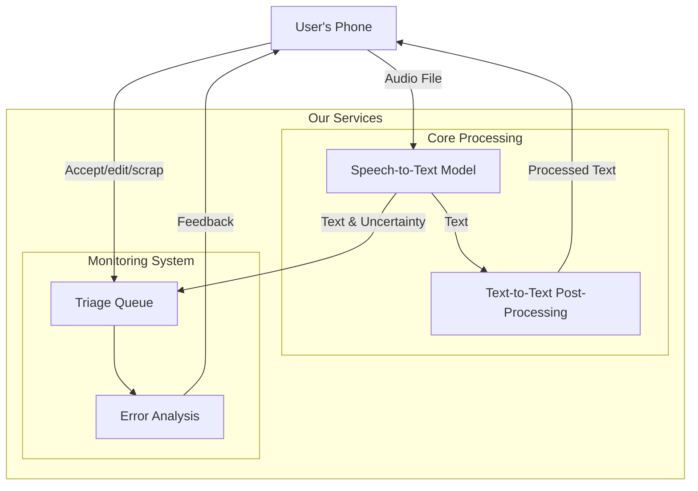

# Continuous monitoring of the quality of output of a multilingual ASR service, and strategies to improve

First some assumptions:

## Error analysis

### Challenge 1: Identifying errors in the output without a ground truth label for everything.  

In order to identify locations in the text that might contain errors, we have a few options:  
**Self reported uncertainty**:  All models that I have worked with have some concept of certainty/probability. STT models do a sort of categorical inference for every token they output (I would assume). This means that it is reasonable to expect that they should be able to produce some sort of certainty for each token they output. Low probability values for the selected output or relatively high probability values for other candidate tokens would be an indication of possible errors.
**Consensus mechanisms**:  I would assume that we probably use the best model we could find, but it might be the case that there are many models that have performance that approaches that of our best-model and hopefully the type or errors they make are un-correlated to one another. In this case these almost-peer models should agree with one another on the output. Disagreement would be an indication of possible errors.
**Semantic Coherence**:  For unprocessed speech to text outputs, individual word errors might be easy to detect by a human or llm, since it is very unlikely that the closest sounding word would make any kind of sense in a sentence. This is based on two somewhat shaky assumptions:
1. The stt model does not already incorporate some sort of semantic coherence and only outputs results on a per work basis based on how correct it sounds.
2. There is very little correlation between phonetic similarity and semantic similarity.  
**Context Coherence**: We expect that all the conversations that our app will be transcribing will be in the health care setting. This means that we can prompt a llm to check for single word errors and to make sure that each sentence makes sense in the context of a healthcare related conversation.

Some combination of the above approaches should be able to help us figure out **where** we are making errors. Some combination of the consensus and coherencerince mechanisms might even be able to programmatically let is figure out what the correct answer should be (to some degree) and if human labelling is required.

### Challenge 2.0: Figure out what the correct answer should be.  

Something like:  
```
if (strong consensus by most models){
    return consensus
} else if (strong confidence in llm context/coherence based correction){
    return llm correction
} else {
    return mark for human review
}
```

### Challenge 2.1: Quantifying the errors that we are making.

Depending on which layer of our pipeline we would like to monitor, we may care more about semantic similarity or phonetic similarity. In all cases I think our output metrics should address both error types.
**Phonetic Similarity**: For phonetic similarity the edit distance will probably be a good metric.  
**Semantic Similarity**: For semantic similarity we would likely need to rely on a llm. The prompt would need to include the the correct and incorrect sentence as well as a couple of examples of correct and incorrect sentences along with scores for each as calibration data.

### Deadly errors  
The above approaches all work dispassionately toward the goal of identifying errors in order to create the best general (ish) purpose stt model.  
In our situation however we have one class of errors that we would like to avoid at all costs and that is the type of error that is likely to lead to adverse patient outcomes. Replacing the word `paracetamol` with `paroxysmal`, is not likely by itself to lead to an adverse patient outcome, but substituting `20` with `200` might.  These deserve their own special handling and for now are outside the scope of this project.


## Monitoring system  

The exact implementation of the monitoring system will depend on our physical and compute constraints, but it could look something like this:

1. User uploads audio file.
2. The audio is transcribed using our best available model.
3. The primary transcription is sent through the existing text-to-text pipeline to produce a secondary transcription.
3. The secondary transcription along with a response ID is sent to the user.
4. The audio file, primary transcription, secondary transcription response IDand meta data are added to a triage Q. Which is to say that the large objects are entered into your data lake in the most efficient way possible, and references to those data objects are entered into a triage queue.

The triage q will work roughly as follows:
1. Low effort go / no go. Green or other.
2. If it's not green we will expend more computing resources and use the mechanisms described above to figure out how bad the error is.
3. If we were able to convince ourselves that the programmatic resolution was successful we will add the data packet to some global benchmarking dataset. If not, we will mark it for human review and then following the review add the data packet to the benchmarking dataset.
4. Depending on how long this all takes and the severity/type of the error we have the opportunity to send the correction back to the user.


## Strategies to improve the quality of the output

In order to decide on an improvement strategy, we would need to have some idea of the cause of the error. Broadly speaking, we have a few options. 
* Retraining the model on the consolidated/corrected data is one option. 
* Pre-processing the audio using classical cleaning methods is another. 
* Modifying our text-to-text pipeline would form a third broad category.
* Swapping out the stt model/API is a fourth option.

It stands to reason that the 2nd option would already have been implemented and optimized by audio engineers with far more experience in this field than us.
The first option is also not super practical, since retraining a modern stt model  can be very resource intensive, and there are other players that can do this far better than us. **However**, data on samples that the model got wrong along with the corrected labels would be incredibly valuable, especially to the model provider and if we can get permission to send that data to the STT model provider, it seems reasonable to expect that they would be inclined to include that data in the next version of the model and is definitely something we should pursue. This leaves us with text-to-text post processing and swapping out the stt model. Swapping out the STT model is quite a dramatic change and does not lend itself to the incremental improvements that one would hope to achieve by implementing a continuous monitoring system. Therefore, text-to-text post processing seems like the best option at present.





### Crap  
Up to this point I completely forgot about the fact that we will show the output to the user and ask them to confirm it. This is a major oversight on my part and will completely change the way we approach this, but I am out of time, so for now let's just go with it. I also realize now that I've strongly neglected the multi-lingual aspect of this project. Soz.


### More thoughts.
It seems vitally important that we identify the speakers in the conversation. This only occurred to me now.

### Rushed planning.
I blew all my time thinking on the text above... ai.

Goal: Implement the phonetic error scoring.

Intermediate challenges:
For our metric to be useful it would be great if it can be used to narrow down where the errors are at least to a sentence level. To do this I would need to align the sentences first. Since the manual transcription is the ground truth we will use that to anchor the alignment.


